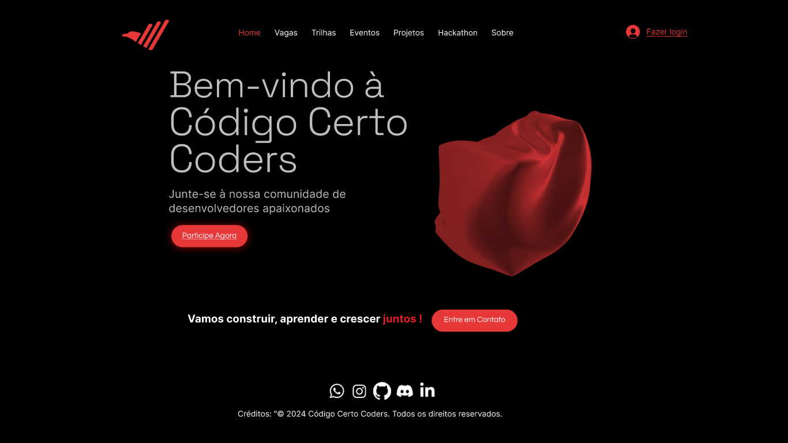
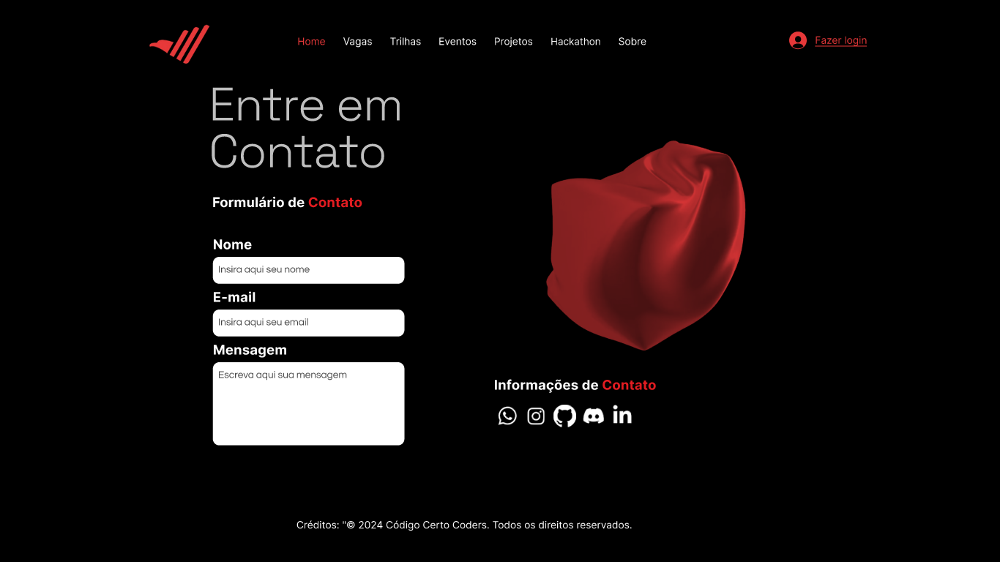

# CodigoCerto-TrilhaDesigner-JUN15

[LINK do projetono figma](https://www.figma.com/design/NHoWPcxnYT9KfexOfoSAlt/codigocertocoders?node-id=1-2&t=pmwrS0QQPoTMjGpf-1)

## 📚 Trilha Inicial UX/UI Design Jr
Este projeto tem como objetivo desenvolver a interface de usuário (UI) e a experiência do usuário (UX) de uma página inicial para a comunidade Codigo Certo Coders.

## Ferramenta de Design Utilizada
Figma: Plataforma de design colaborativo baseada em nuvem, ideal para prototipagem de interfaces de usuário e design de experiência do usuário (UX/UI).

## Requisitos de Design e Funcionalidade
Design Moderno e Responsivo: Garantir que a página seja visualmente atraente e funcional em diferentes dispositivos.
Protótipos em Web e Mobile: Criar protótipos completos da interface de usuário (UI) para a plataforma de streaming de educação nas versões web e mobile utilizando o Figma.
Garantir que ambos os protótipos apresentem todas as funcionalidades principais e elementos de design necessários para uma experiência completa do usuário.
Primordial: Utilizar as cores da paleta da Codigo Certo Coders: Codigo Certo Coders Cores

#000000 (preto)

#e53939 (vermelho)

#ffffff (branco)

Exemplo de Estrutura Detalhada: 🛠️

### 1. Cabeçalho (Header)
Logo: Coloque o logotipo da comunidade no canto superior esquerdo.

### 2. Seção de Introdução (Hero Section):
Imagem de Fundo: Uma imagem inspiradora relacionada à programação e tecnologia.
Título: "Bem-vindo à Código Certo Coders"
Subtítulo: "Junte-se à nossa comunidade de desenvolvedores apaixonados."
Botão de CTA (Call to Action): "Participe Agora"

### 3. Seção de Contato:
Título: "Entre em Contato"
Formulário de Contato: Campos para nome, email e mensagem.
Informações de Contato: Email, redes sociais, etc.

### 4. Rodapé (Footer):
Redes Sociais: Ícones para WhatsApp, Discord, LinkedIn, etc.
Créditos: "© 2024 Código Certo Coders. Todos os direitos reservados."

